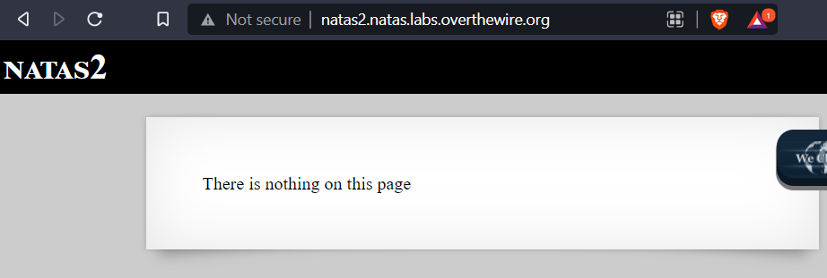
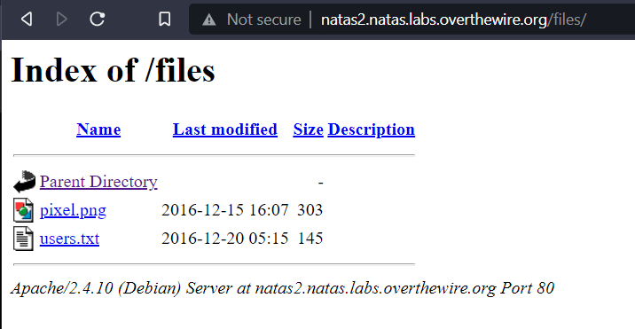
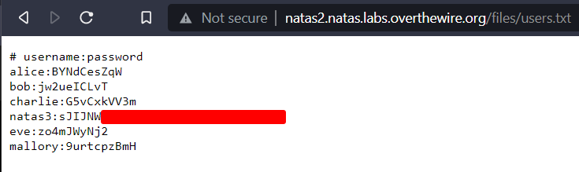

# Natas Level 1 -> Level 2

## Description

Username: natas2  

URL:      http://natas2.natas.labs.overthewire.org

---

## Walkthrough

Visit the url `http://natas2.natas.labs.overthewire.org` in the browser and we get a prompt for login.

Use the username `natas2` and the password obtained from the previous challenge.

The home page has a message stating nothing on the page. 




Checking the source code with `Ctrl+U` we find an image tag for a file `files/pixel.png`

```html

<html>
<head>
<!-- This stuff in the header has nothing to do with the level -->
<link rel="stylesheet" type="text/css" href="http://natas.labs.overthewire.org/css/level.css">
<link rel="stylesheet" href="http://natas.labs.overthewire.org/css/jquery-ui.css" />
<link rel="stylesheet" href="http://natas.labs.overthewire.org/css/wechall.css" />
<script src="http://natas.labs.overthewire.org/js/jquery-1.9.1.js"></script>
<script src="http://natas.labs.overthewire.org/js/jquery-ui.js"></script>
<script src=http://natas.labs.overthewire.org/js/wechall-data.js></script><script src="http://natas.labs.overthewire.org/js/wechall.js"></script>
<script>var wechallinfo = { "level": "natas2", "pass": "ZluruAthQk7Q2MqmDeTiUij2ZvWy2mBi" };</script></head>
<body>
<h1>natas2</h1>
<div id="content">
There is nothing on this page

</div>
</body></html>
```


When we visit the `files` directory we find more items to investigate.




The password for natas3 is in the `users.txt` file.


